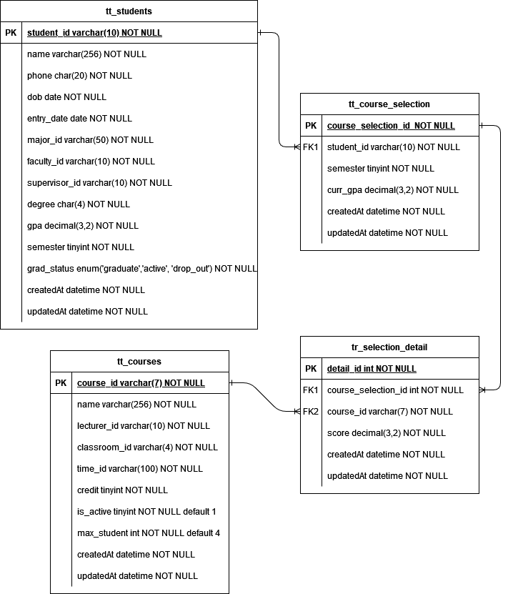

# Table of Contents
- [Case Study](#about)
- [Getting Started](#gettingstarted)


# Case Study : KRS Application

## Requirement
KRS (Kartu Rencana Studi) merupakan daftar mata kuliah yang akan diikuti atau diambil oleh mahasiswa dalam satu semester ke depan. Tujuan dari studi kasus ini adalah membuat API untuk mendaftar krs bagi mahasiswa dg aturan sbg berikut:
- 1 Mahasiswa bisa mengambil maksimal 3 Mata Kuliah.
- 1 Mata Kuliah bisa memiliki maksimal 4 Mahasiswa.
Selain itu pada API ini disediakan CRUD untuk menginput data mahasiswa dan Kuliah


## Solution
Dalam pengisian krs diasumsikan mahasiswa memilih mata kuliah yang ingin didaftarkan untuk semester tertentu. Apabila sudah mengisi krs untuk semester tertentu, maka  krs untuk semester tersebut tidak bisa diajukan lagi. Apabila pada daftar mata kuliah yang didaftarkan sudah penuh, maka akan ditampilkan pesan bahwa beberapa mata kuliah telah terisi


### ERD
 \
Data mahasiswa disimpan pada tabel `tt_students`, data mata kuliah disimpan pada tabel `tt_courses`.
Untuk data krs setiap mahasiswa per semester disimpan pada tabel `tt_course_selection` dengan mata kuliah yang dipilih disimpan pada tabel `tr_selection_detail`


#### Primary Key Concern
- `student_id` contain 10 char, with pattern as follows: 
  YYFCMCXXXX
  YY : Year of entry
  FC : Major Code
  MC : Faculty Code
  XXXX : Sequence of entry
  ex : 1411070021
- `course_id` contain 7 char, with pattern as follows:
  FFSXAAAA
  FF : Major Nickname (unique)
  SX : Semester code
  AAAA : Sequence of entry
  ex : TKS4095

#### Simplification 
For simplicity of the case, some fields that should be join from antoher table are not directly defined. It is assumed that the user of API understand how to fill the correct data. 
- `tr_students` Table
   - `major_id`: It should be filled as id from `major` table (table that contain of Major detail). We assume user fill with string like: `TEKNIK KIMIA`, `TEKNIK INFORMATIKA`
   - `faculty_id`: It should be filled as id from `faculty` table (table that contain of Faculty detail). We assume user fill with string like: `Teknik` , `FMIPA` 
   - `degree` : It should be filled as id from `degree` table (table that contain of Degree detail). We assume user filled with string like: `D3` , `S1`, `S2`, `S3` 
   - `supervisor_id`: It should be filled as id from `lecturer` table (table that contain of Lecturer detail). We assume user fill with string with 10 characters like:  `1234567890` 
- `tr_courses` Table
   - `lecture_id` : It should be filled as id from `lecturer` table (table that contain of Lecturer detail). We assume user fill with string with 10 characters like:  `1234567890` 
   - `classroom_id` : It should be filled as id from `classroom` table (table that contain of classroom detail). We assume user fill with string with 10 characters like:  `1234567890` 
   - `time_id` : It should be filled as id from `time` table (table that contain of schedule detail). We assume user fill with string like:  `Sunday 8 AM` 

#### Assumption
In real case some field in the table might not be filled directly by providing data in request body. Here some assumption is defined for simplicity of the case. Some field assumed can be filled manually when first creation:
- `student_id` in `tt_students` \
  It is already mention that this id contain combination of faculty code and major code that can be provided . Ideally, we calculate based on faculty and major id from their corresponding table, but because on this case we dont have that master table, we assumed that it can be provided manually
- `semester` in `tt_students` \
  Ideally, It is calculate based on how many years the student entered the college
-  `gpa` in `tt_students` \
  Ideally, It is calculated based on average `curr_gpa` from `tt_course_collection`. It is assumed when first creation is 0
- `course_id` in `tt_courses` \
  It is already mention that this id contain combination of  major nickname. Because In this case we dont have that master table, we assumed that it can be provided manually


# Getting Started


## Installation
```
git clone https://github.com/ditanh97/api-pengajuan-krs.git
cd api-pengajuan.krs
yarn
```

## Run
```
yarn run dev
```


